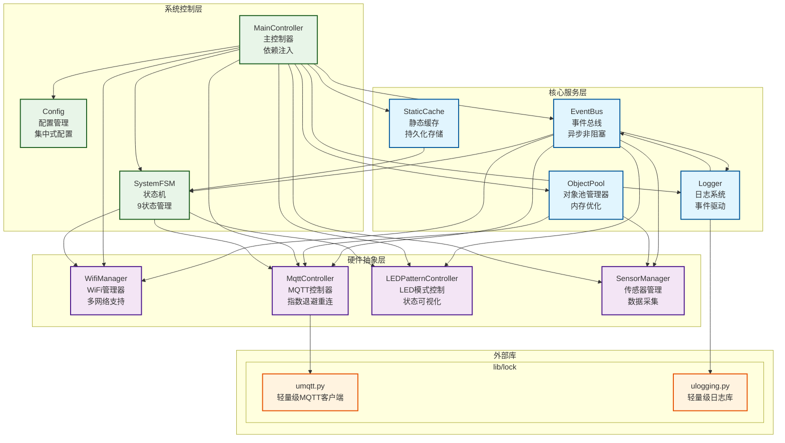
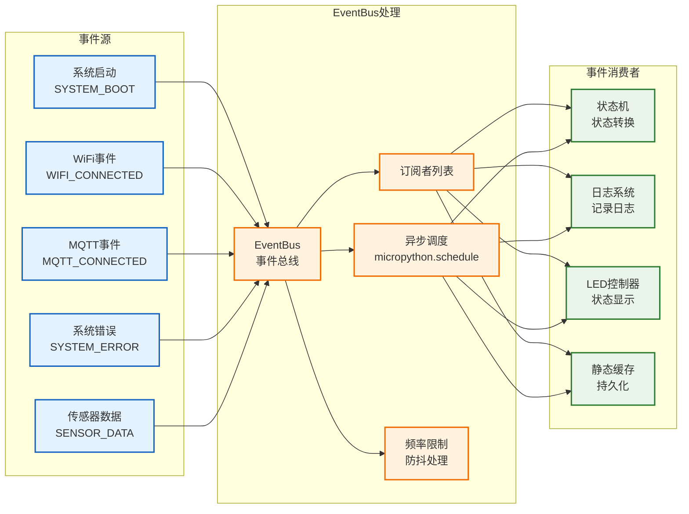
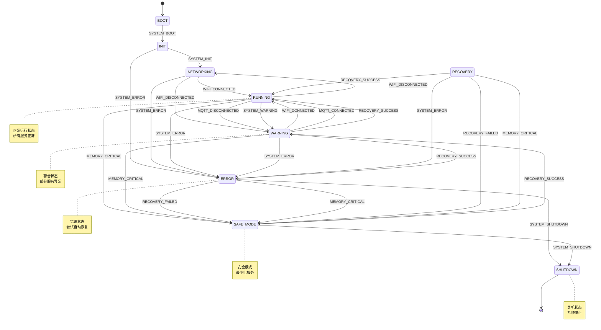
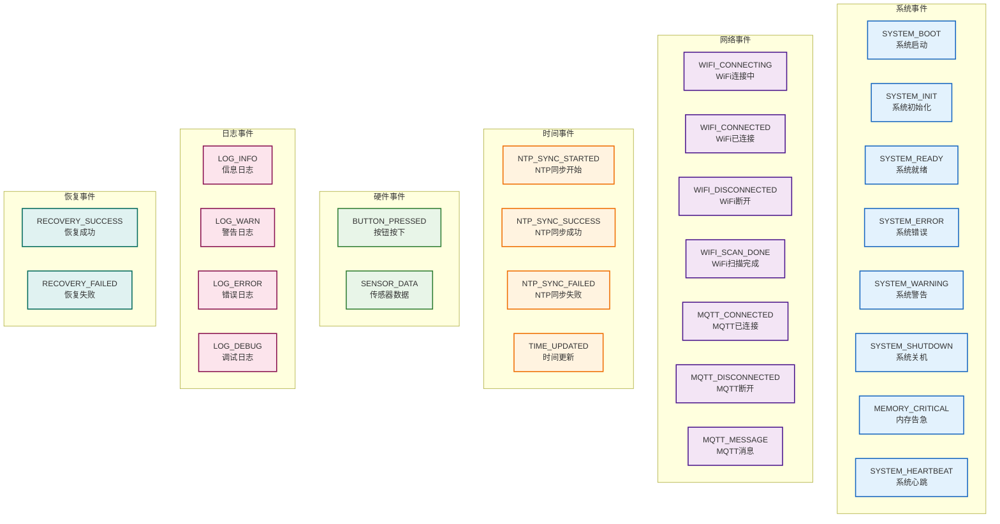
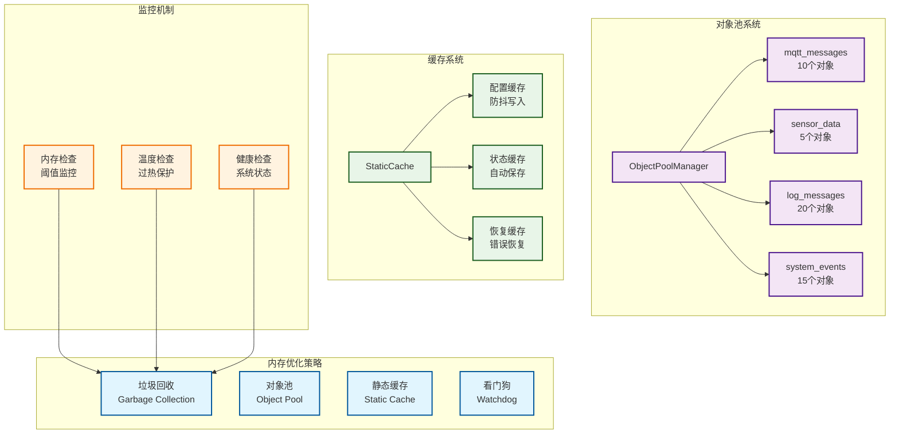

# ESP32-C3 IoT事件驱动架构图

## 1. 核心架构图

## 2. 事件流程图

## 3. 状态机转换图

## 4. 模块依赖关系图

```mermaid
graph TB
    subgraph "入口点"
        MAIN[main.py<br/>系统入口]
    end
    
    subgraph "核心服务"
        EB[lib/event_bus.py]
        OP[lib/object_pool.py]
        SC[lib/static_cache.py]
        LG[lib/logger.py]
    end
    
    subgraph "网络层"
        WIFI[net/wifi.py]
        MQTT[net/mqtt.py]
    end
    
    subgraph "硬件层"
        LED[hw/led.py]
        SENSOR[hw/sensor.py]
    end
    
    subgraph "系统层"
        FSM[fsm.py]
        CFG[config.py]
        EVT[event_const.py]
    end
    
    subgraph "工具层"
        HELPERS[utils/helpers.py]
        TIMERS[utils/timers.py]
    end
    
    subgraph "外部库"
        UMQTT[lib/lock/umqtt.py]
        ULOG[lib/lock/ulogging.py]
    end
    
    %% 依赖关系
    MAIN --> CFG
    MAIN --> EB
    MAIN --> OP
    MAIN --> SC
    MAIN --> LG
    MAIN --> FSM
    MAIN --> WIFI
    MAIN --> MQTT
    MAIN --> LED
    MAIN --> SENSOR
    
    FSM --> EB
    FSM --> OP
    FSM --> SC
    FSM --> CFG
    FSM --> EVT
    
    WIFI --> EB
    WIFI --> EVT
    
    MQTT --> EB
    MQTT --> OP
    MQTT --> EVT
    MQTT --> UMQTT
    
    LED --> EVT
    
    SENSOR --> EB
    SENSOR --> OP
    SENSOR --> EVT
    
    LG --> EB
    LG --> EVT
    LG --> ULOG
    
    HELPERS --> CFG
    TIMERS --> CFG
    
    %% 样式
    classDef entry fill:#ffecb3,stroke:#ff6f00,stroke-width:2px
    classDef core fill:#e1f5fe,stroke:#01579b,stroke-width:2px
    classDef network fill:#f3e5f5,stroke:#4a148c,stroke-width:2px
    classDef hardware fill:#e8f5e8,stroke:#1b5e20,stroke-width:2px
    classDef system fill:#fff3e0,stroke:#e65100,stroke-width:2px
    classDef utils fill:#fce4ec,stroke:#880e4f,stroke-width:2px
    classDef external fill:#efebe9,stroke:#3e2723,stroke-width:2px
    
    class MAIN entry
    class EB,OP,SC,LG core
    class WIFI,MQTT network
    class LED,SENSOR hardware
    class FSM,CFG,EVT system
    class HELPERS,TIMERS utils
    class UMQTT,ULOG external
```

## 5. 事件类型层次图

## 6. 内存管理架构图

## 架构特点总结

1. **事件驱动**: 以EventBus为核心的松耦合架构
2. **异步处理**: 使用micropython.schedule实现非阻塞事件处理
3. **状态管理**: 9个系统状态，支持自动错误恢复
4. **内存优化**: 对象池、静态缓存、智能垃圾回收
5. **错误隔离**: 频率限制、错误递归保护、降级处理
6. **模块化设计**: 清晰的层次结构，易于维护和扩展