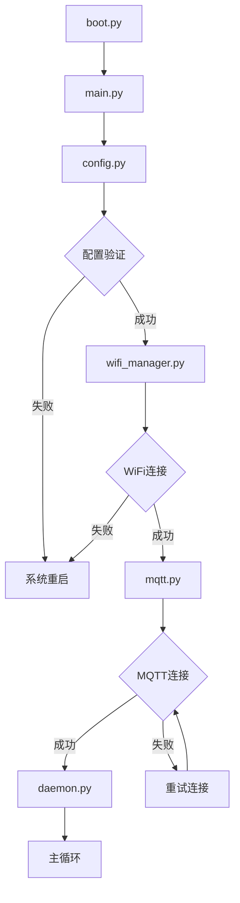
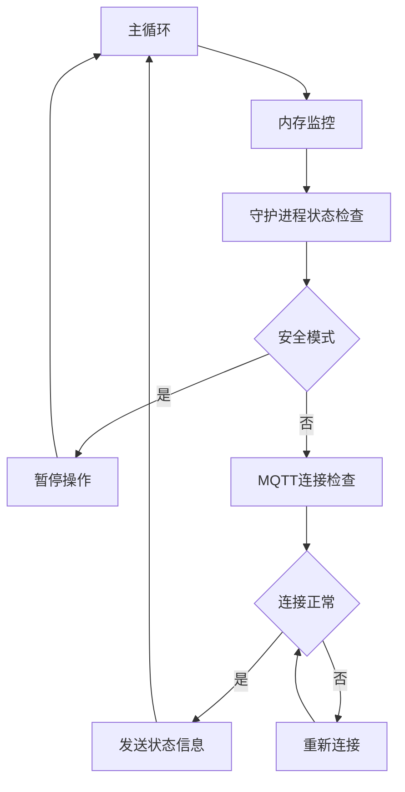
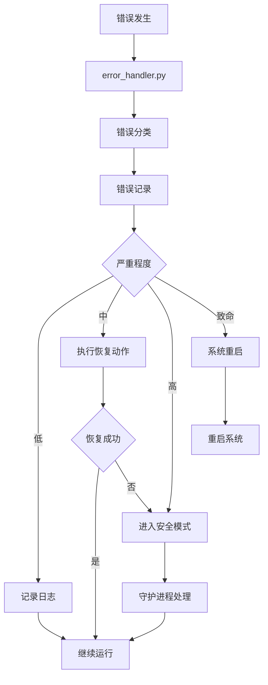
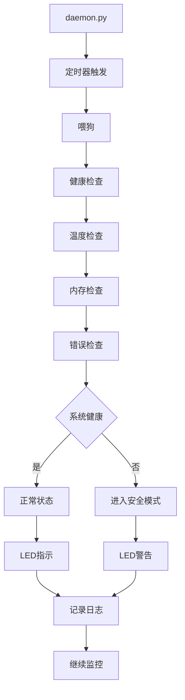

# ESP32C3 IoT 设备项目

## 项目概述

这是一个基于ESP32C3的MicroPython物联网设备项目，旨在提供稳定可靠的IoT设备运行环境。项目采用模块化设计，支持WiFi连接、MQTT通信、系统监控和错误恢复等功能，特别适用于Home Assistant智能家居系统。

## 项目架构

### 目录结构

```
src/
├── application/          # 应用层
│   ├── boot.py          # 启动脚本
│   ├── config.py        # 统一配置管理
│   └── main.py          # 主程序入口
├── service/             # 服务层
│   ├── network/         # 网络服务
│   │   ├── mqtt.py      # MQTT通信服务
│   │   └── wifi_manager.py # WiFi管理服务
│   └── system/          # 系统服务
│       ├── daemon.py    # 守护进程
│       ├── error_handler.py # 错误处理
│       └── status_monitor.py # 状态监控
└── lib/                 # 第三方库
    └── umqtt/           # MQTT客户端库
        └── simple.py
```

### 模块层次结构

```
应用层 (Application Layer)
├── main.py - 主程序入口，协调各模块运行
├── config.py - 统一配置管理
└── boot.py - 系统启动脚本

服务层 (Service Layer)
├── 网络服务 (Network Services)
│   ├── wifi_manager.py - WiFi连接管理
│   └── mqtt.py - MQTT通信服务
└── 系统服务 (System Services)
    ├── daemon.py - 系统守护进程
    ├── error_handler.py - 错误处理和日志
    └── status_monitor.py - 状态监控

库层 (Library Layer)
└── umqtt/ - MQTT客户端库
```

## 核心模块详解

### 1. 应用层模块

#### main.py - 主程序入口
**作用**: 系统的主控制中心，负责协调各模块的运行顺序和生命周期管理。

**主要功能**:
- 系统初始化和配置验证
- WiFi连接管理
- MQTT客户端创建和连接
- 守护进程启动
- 主循环控制和内存管理
- 系统状态监控和报告

**与其他模块的交互**:
- 依赖 `config.py` 获取系统配置
- 调用 `wifi_manager.py` 建立WiFi连接
- 使用 `mqtt.py` 创建MQTT客户端
- 启动 `daemon.py` 守护进程
- 通过 `status_monitor.py` 获取系统状态

#### config.py - 统一配置管理
**作用**: 集中管理所有系统配置参数，提供配置验证和管理功能。

**主要功能**:
- 定义MQTT、WiFi、守护进程、系统等配置类
- 提供配置验证机制
- 配置参数有效性检查
- 配置信息打印和调试

**配置分类**:
- `MQTTConfig`: MQTT服务器连接参数
- `WiFiConfig`: WiFi网络配置
- `DaemonConfig`: 守护进程参数
- `SystemConfig`: 系统级参数

#### boot.py - 启动脚本
**作用**: 系统启动时首先执行的脚本，负责初始化垃圾回收。

**主要功能**:
- 初始化垃圾回收器
- 执行初始内存清理

### 2. 网络服务模块

#### wifi_manager.py - WiFi管理服务
**作用**: 提供健壮的WiFi连接管理和NTP时间同步功能。

**主要功能**:
- 多WiFi网络支持，按信号强度自动选择
- 网络扫描和RSSI排序
- 自动重连和错误恢复
- NTP时间同步和时区设置
- 连接状态监控

**与其他模块的交互**:
- 从 `config.py` 获取WiFi配置
- 为 `main.py` 提供连接接口
- 支持系统时间同步

#### mqtt.py - MQTT通信服务
**作用**: 提供高效的MQTT通信功能，支持自动重连和内存优化。

**主要功能**:
- MQTT客户端创建和连接管理
- 自动重连机制
- 内存优化的日志发送
- 连接状态监控
- 错误恢复机制

**与其他模块的交互**:
- 从 `config.py` 获取MQTT配置
- 被 `main.py` 调用创建客户端
- 被 `daemon.py` 用于发送系统日志

### 3. 系统服务模块

#### daemon.py - 系统守护进程
**作用**: 提供系统监控和安全保护功能，确保设备稳定运行。

**主要功能**:
- LED状态指示控制
- 温度监控和安全模式
- 看门狗保护
- 内存监控和垃圾回收
- 系统健康检查
- 错误处理和恢复

**与其他模块的交互**:
- 从 `config.py` 获取守护进程配置
- 使用 `mqtt.py` 发送系统日志
- 与 `error_handler.py` 协作处理错误
- 被 `main.py` 启动和管理

#### error_handler.py - 错误处理和日志
**作用**: 提供集中式错误处理和日志管理功能。

**主要功能**:
- 统一错误分类和处理
- 智能日志系统
- 自动错误恢复机制
- 内存友好的日志缓冲
- 错误严重程度分类
- 智能恢复策略

**与其他模块的交互**:
- 被 `daemon.py` 调用处理错误
- 与 `status_monitor.py` 共享错误信息
- 使用 `mqtt.py` 发送错误日志

#### status_monitor.py - 状态监控
**作用**: 提供轻量级的系统状态监控功能。

**主要功能**:
- 系统状态监控
- 组件健康检查
- 内存监控
- 简化的日志系统
- 状态变更记录

**与其他模块的交互**:
- 被 `main.py` 调用获取系统状态
- 与 `daemon.py` 协作监控系统健康
- 从 `error_handler.py` 获取错误统计

## 模块相互作用流程

### 1. 系统启动流程



### 2. 主循环运行流程



### 3. 错误处理流程



### 4. 系统监控流程



## 内存管理策略

### 1. 内存优化设计

- **全局变量使用**: 减少实例化开销
- **限制监控频率**: 避免频繁的资源消耗
- **智能垃圾回收**: 根据内存使用情况动态调整
- **轻量级数据结构**: 使用简单数据类型
- **日志缓冲限制**: 限制历史记录大小

### 2. 垃圾回收策略

- **定期回收**: 每次循环执行垃圾回收
- **按需回收**: 内存使用超过阈值时强制回收
- **深度回收**: 系统异常时执行深度清理
- **安全模式回收**: 安全模式下更频繁的回收

## 错误恢复机制

### 1. 网络错误恢复

- **WiFi重连**: 自动扫描和重连最优网络
- **MQTT重连**: 断线后自动重连，支持指数退避
- **NTP重试**: 时间同步失败时自动重试

### 2. 系统错误恢复

- **安全模式**: 系统异常时进入保护模式
- **看门狗保护**: 防止系统死锁
- **自动重启**: 致命错误时自动重启设备
- **内存清理**: 内存不足时自动清理

### 3. 应用错误恢复

- **错误分类**: 根据错误类型采取不同恢复策略
- **重试机制**: 可恢复错误的自动重试
- **降级运行**: 部分功能失效时的降级模式

## 配置管理

### 1. 配置文件结构

```python
# MQTT配置
class MQTTConfig:
    BROKER = "192.168.1.2"
    PORT = 1883
    TOPIC = "lzs/esp32c3"
    KEEPALIVE = 60

# WiFi配置
class WiFiConfig:
    NETWORKS = [
        {"ssid": "network1", "password": "password1"},
        {"ssid": "network2", "password": "password2"}
    ]
    TIMEOUT_S = 15

# 守护进程配置
class DaemonConfig:
    LED_PINS = [12, 13]
    TEMP_THRESHOLD = 60.0
    MEMORY_THRESHOLD = 90
    MONITOR_INTERVAL = 30000

# 系统配置
class SystemConfig:
    DEBUG_MODE = False
    MAIN_LOOP_DELAY = 300
    AUTO_RESTART_ENABLED = True
```

### 2. 配置验证机制

- **启动时验证**: 系统启动时自动验证所有配置
- **类型检查**: 确保配置参数类型正确
- **范围检查**: 验证数值在合理范围内
- **依赖检查**: 检查配置间的依赖关系

## 部署和使用

### 1. 文件上传

使用MicroPython工具将文件上传到ESP32C3：

```bash
# 上传应用层文件
rshell cp src/application/boot.py /pyboard/boot.py
rshell cp src/application/config.py /pyboard/config.py
rshell cp src/application/main.py /pyboard/main.py

# 上传服务层文件
rshell cp src/service/network/mqtt.py /pyboard/mqtt.py
rshell cp src/service/network/wifi_manager.py /pyboard/wifi_manager.py
rshell cp src/service/system/daemon.py /pyboard/daemon.py
rshell cp src/service/system/error_handler.py /pyboard/error_handler.py
rshell cp src/service/system/status_monitor.py /pyboard/status_monitor.py

# 上传库文件
rshell cp src/lib/umqtt/simple.py /pyboard/umqtt/simple.py
```

### 2. 配置修改

根据实际环境修改 `config.py` 中的配置：

- 修改WiFi网络配置
- 设置MQTT服务器地址
- 调整监控参数
- 配置LED引脚

### 3. 设备测试

设备启动后，通过串口查看输出：

- WiFi连接状态
- MQTT连接状态
- 系统监控信息
- 内存使用情况
- 错误和警告信息

## 开发指南

### 1. 添加新功能

1. **确定功能层次**: 根据功能性质确定属于应用层、服务层还是库层
2. **创建模块文件**: 在相应目录创建新的Python文件
3. **更新导入路径**: 确保模块间导入路径正确
4. **配置管理**: 在 `config.py` 中添加相关配置
5. **错误处理**: 集成到统一的错误处理机制
6. **日志记录**: 使用统一的日志系统

### 2. 修改现有功能

1. **理解模块关系**: 了解修改的模块与其他模块的交互
2. **更新配置**: 如需新配置项，在 `config.py` 中添加
3. **测试验证**: 确保修改不影响其他模块功能
4. **内存测试**: 验证内存使用情况
5. **错误测试**: 测试错误处理和恢复机制

### 3. 调试技巧

1. **启用调试模式**: 在 `config.py` 中设置 `DEBUG_MODE = True`
2. **查看日志**: 通过串口查看详细日志信息
3. **内存监控**: 观察内存使用情况，及时发现内存泄漏
4. **状态监控**: 通过 `status_monitor.py` 查看系统状态
5. **错误统计**: 查看 `error_handler.py` 的错误统计信息

## 注意事项

### 1. 内存限制

- ESP32C3内存有限，约264KB RAM
- 避免创建大对象和复杂数据结构
- 定期监控内存使用情况
- 及时释放不再使用的资源

### 2. 实时性要求

- 主循环延迟不宜过长
- 避免阻塞操作
- 合理设置定时器间隔
- 确保看门狗正常工作

### 3. 网络稳定性

- WiFi连接可能不稳定，需要重连机制
- MQTT连接需要心跳保持
- 网络操作要有超时处理
- 考虑网络中断时的降级运行

### 4. 电源管理

- 合理设置睡眠模式
- 避免不必要的硬件操作
- 优化CPU使用率
- 考虑电池供电场景

## 总结

本项目采用模块化设计，通过清晰的层次结构和模块间的协作，提供了一个稳定可靠的ESP32C3 IoT设备解决方案。项目重点考虑了内存管理、错误恢复和系统稳定性，适合在资源受限的嵌入式环境中运行。

通过统一的配置管理、完善的错误处理机制和系统监控功能，项目能够适应各种复杂的运行环境，为Home Assistant等智能家居系统提供可靠的设备支持。
