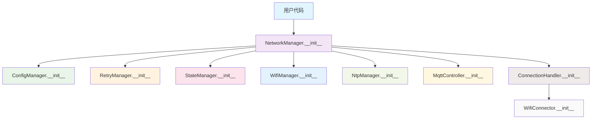
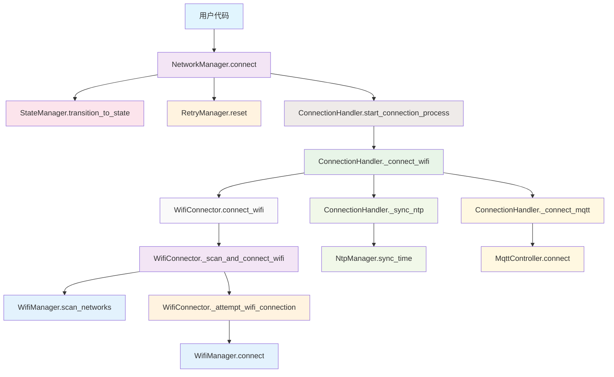
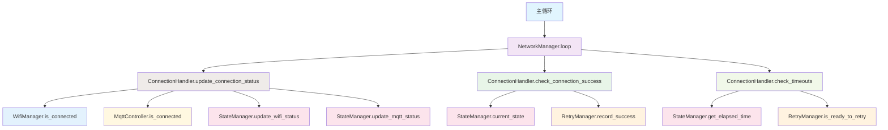
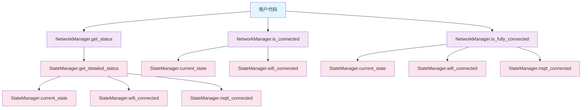
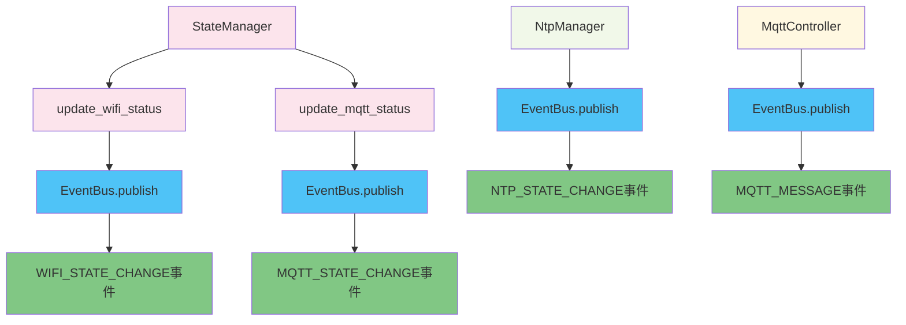
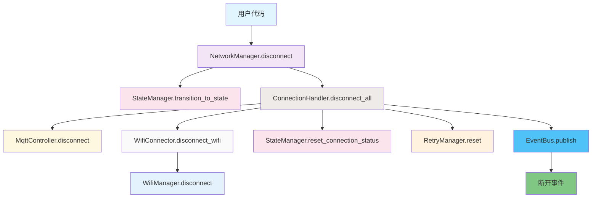

# 网络模块说明文档 (_README_NET.md)

## 概述

网络模块 (`app/net/`) 提供了统一的网络连接管理功能, 包括WiFi连接、NTP时间同步和MQTT通信。模块采用**模块化架构**, 将功能拆分为专门的功能模块，提供高可维护性、清晰的职责分离和优秀的扩展性。

## 模块结构

```
app/net/
├── __init__.py          # 模块初始化和导出
├── index.py             # 网络统一控制器(96行)
├── wifi.py              # WiFi管理器(116行)
├── ntp.py               # NTP时间同步管理器(73行)
├── mqtt.py              # MQTT控制器(174行)
└── modules/             # 功能模块目录
    ├── __init__.py      # 模块导出(15行)
    ├── config_manager.py    # 配置管理(77行)
    ├── retry_manager.py     # 重试逻辑(81行)
    ├── state_manager.py     # 状态管理(106行)
    ├── wifi_connector.py    # WiFi连接(85行)
    └── connection_handler.py # 连接处理(177行)
```

## 核心特性

### 1. 模块化架构
- **职责分离**: 每个模块专注单一功能，职责清晰
- **依赖注入**: 模块间通过构造函数注入依赖，松耦合设计
- **可扩展性**: 新功能可独立模块化，不影响现有代码
- **可测试性**: 每个模块可独立测试，便于单元测试

### 2. 统一连接流程
- **连接顺序**: WiFi → NTP → MQTT
- **依赖关系**: MQTT依赖于WiFi, NTP依赖于WiFi
- **优雅降级**: NTP失败不影响MQTT连接

### 3. 智能重试机制
- **指数退避**: `delay = base_delay * (2 ^ (retry_count - 1))`
- **最大延迟**: 可配置的最大退避时间(默认30000ms)
- **重试限制**: 可配置的最大重试次数(默认3次)

### 4. 灵活配置管理
- **默认配置**: 完整的WiFi、MQTT、NTP默认配置
- **配置验证**: 运行时配置验证和默认值处理
- **模块化配置**: 不同功能模块独立配置管理

### 5. 精确状态管理
- **状态跟踪**: 实时跟踪WiFi和MQTT连接状态
- **状态聚合**: 提供网络可用性和完全连接状态
- **事件发布**: 标准化的状态变化事件发布

### 6. 事件驱动架构
- **状态变化**: 通过EventBus发布连接状态变化
- **错误处理**: 统一的错误事件发布
- **系统响应**: 响应系统状态变化事件

## 组件说明

### NetworkManager (网络统一控制器) - index.py

**功能**: 网络统一控制器，协调各功能模块，提供简洁的公共接口。

**初始化**:
```python
from app.net import NetworkManager
network_manager = NetworkManager(event_bus, config)
```
- `event_bus`: 事件总线实例 (lib.lock.event_bus.EventBus)
- `config`: 配置字典 (可选，未提供时使用默认配置)

**暴露方法**:
- `connect()`: 启动网络连接流程
- `disconnect()`: 断开所有网络连接
- `loop()`: 主循环处理 (需在主循环中定期调用)
- `get_status()`: 获取当前网络状态
- `is_connected()`: 检查是否已连接 (基于WiFi)
- `is_fully_connected()`: 检查是否完全连接 (WiFi+MQTT)
- `publish_mqtt_message(topic, message, retain=False, qos=0)`: 发送MQTT消息
- `subscribe_mqtt_topic(topic, qos=0)`: 订阅MQTT主题
- `get_mqtt_status()`: 获取MQTT连接状态

**状态返回**:
```python
status = network_manager.get_status()
# 返回: {
#     'state': 'CONNECTED'|'CONNECTING'|'DISCONNECTED',
#     'wifi_connected': bool,
#     'mqtt_connected': bool,
#     'retry_count': int,
#     'network_available': bool,
#     'full_connectivity': bool
# }
```

### 功能模块

#### ConfigManager (配置管理器) - modules/config_manager.py
**功能**: 统一的配置管理，提供默认值和运行时验证。

**主要功能**:
- 默认配置管理
- 配置验证和合并
- 分段配置获取

#### RetryManager (重试管理器) - modules/retry_manager.py
**功能**: 智能重试逻辑，支持指数退避策略。

**主要功能**:
- 指数退避重试
- 重试计数和限制
- 成功记录和状态重置

#### StateManager (状态管理器) - modules/state_manager.py
**功能**: 网络状态管理和事件发布。

**主要功能**:
- 状态转换管理
- 连接状态跟踪
- 状态变化事件发布

#### WifiConnector (WiFi连接器) - modules/wifi_connector.py
**功能**: 专门的WiFi连接逻辑，包括网络扫描和连接。

**主要功能**:
- WiFi网络扫描
- 多网络选择(RSSI排序)
- 连接建立和超时处理

#### ConnectionHandler (连接处理器) - modules/connection_handler.py
**功能**: 主要连接流程和MQTT/NTP连接管理。

**主要功能**:
- 连接流程协调
- MQTT连接管理
- NTP时间同步
- 连接超时处理

### 基础组件

#### WifiManager (WiFi管理器) - wifi.py
**功能**: 底层WiFi连接功能，提供网络扫描和连接管理。

**主要方法**:
- `connect(ssid, password)`: 连接WiFi
- `disconnect()`: 断开WiFi
- `is_connected()`: 检查连接状态
- `scan_networks(timeout_ms=5000)`: 扫描可用网络
- `get_current_network()`: 获取当前连接的网络信息

#### NtpManager (NTP时间同步管理器) - ntp.py
**功能**: 底层时间同步功能，提供NTP时间同步服务。

**主要方法**:
- `sync_time()`: 同步时间
- `is_synced()`: 检查同步状态
- `get_last_sync_time()`: 获取上次同步时间

#### MqttController (MQTT控制器) - mqtt.py
**功能**: 底层MQTT通信功能，提供消息发布和订阅服务。

**主要方法**:
- `connect()`: 连接MQTT
- `disconnect()`: 断开MQTT
- `publish(topic, msg, retain=False, qos=0)`: 发布消息
- `subscribe(topic, qos=0)`: 订阅主题
- `loop()`: 处理循环
- `is_connected()`: 检查连接状态

**默认配置**:
```python
# WiFi配置
wifi_config = {
    'networks': [
        {"ssid": "zsm60p", "password": "25845600"},
        {"ssid": "leju_software", "password": "leju123456"},
        {"ssid": "CMCC-pdRG", "password": "7k77ed5p"}
    ]
}

# MQTT配置
mqtt_config = {
    'broker': '192.168.3.15',
    'port': 1883,
    'user': '',
    'password': '',
    'keepalive': 60
}

# NTP配置
ntp_config = {
    'ntp_server': 'ntp1.aliyun.com',
    'ntp_max_attempts': 3,
    'ntp_retry_interval': 2
}

# 连接配置
connection_config = {
    'max_retries': 3,
    'base_retry_delay': 1000,
    'connection_timeout': 20000
}
```

## 使用示例

### 基本初始化和连接
```python
from lib.lock.event_bus import EventBus
from app.net import NetworkManager

# 创建事件总线
event_bus = EventBus()

# 创建网络管理器 (可选配置，未提供时使用默认配置)
network_manager = NetworkManager(event_bus)

# 启动连接
network_manager.connect()

# 主循环处理
while True:
    network_manager.loop()
    time.sleep(0.05)  # 建议循环延迟50ms
```

### 发送和接收MQTT消息
```python
# 发送消息
success = network_manager.publish_mqtt_message('home/sensor/temperature', '25.5')

# 订阅主题
success = network_manager.subscribe_mqtt_topic('home/command/+')

# 接收消息 (通过事件总线)
def handle_mqtt_message(data):
    topic = data.get('topic')
    message = data.get('message')
    print(f"收到消息: {topic} = {message}")

from lib.lock.event_bus import EVENTS
event_bus.subscribe(EVENTS.MQTT_MESSAGE, handle_mqtt_message)
```

### 状态监控
```python
# 获取详细状态
status = network_manager.get_status()
print(f"网络状态: {status['state']}")
print(f"WiFi连接: {status['wifi_connected']}")
print(f"MQTT连接: {status['mqtt_connected']}")
print(f"重试次数: {status['retry_count']}")

# 简单状态检查
if network_manager.is_connected():
    print("网络可用")
    
if network_manager.is_fully_connected():
    print("完全连接 (WiFi+MQTT)")
```

### 事件处理
```python
from lib.lock.event_bus import EVENTS

# WiFi状态变化
def handle_wifi_change(data):
    state = data.get('state')
    print(f"WiFi状态: {state}")

event_bus.subscribe(EVENTS.WIFI_STATE_CHANGE, handle_wifi_change)

# MQTT状态变化
def handle_mqtt_change(data):
    state = data.get('state')
    error = data.get('error')
    print(f"MQTT状态: {state}")
    if error:
        print(f"错误信息: {error}")

event_bus.subscribe(EVENTS.MQTT_STATE_CHANGE, handle_mqtt_change)

# NTP状态变化
def handle_ntp_change(data):
    state = data.get('state')
    print(f"NTP同步: {state}")

event_bus.subscribe(EVENTS.NTP_STATE_CHANGE, handle_ntp_change)
```

## 模块化架构优势

### 1. 职责分离
- **专门化**: 每个模块专注单一功能
- **清晰性**: 代码结构清晰，便于理解
- **维护性**: 问题定位更精确

### 2. 松耦合设计
- **依赖注入**: 模块间通过构造函数注入依赖
- **接口隔离**: 外部接口简洁，内部实现模块化
- **可替换性**: 模块可独立替换或升级

### 3. 开发效率
- **并行开发**: 不同模块可并行开发
- **代码复用**: 模块可在其他项目中复用
- **调试友好**: 问题定位更精确

### 4. 性能优化
- **表面封装消除**: 减少了不必要的包装方法
- **直接访问**: 关键路径直接属性访问
- **内存优化**: 减少了重复代码和对象创建

### 5. 扩展性
- **模块化**: 新功能可独立模块化
- **插件化**: 支持功能模块的动态加载
- **兼容性**: 保持接口兼容，便于升级

## 重构成果

### 代码行数优化
- **NetworkManager**: 从429行减少到96行 (减少77.6%)
- **ConnectionHandler**: 177行 (专注连接处理)
- **StateManager**: 106行 (专注状态管理)
- **WifiConnector**: 85行 (专注WiFi连接)
- **其他模块**: 配置管理(77行)、重试管理(81行)
- **总体效果**: 主控制器显著精简，功能完全模块化

### 进一步优化成果
- **消除重复逻辑**: NetworkManager 的状态检查方法委托给 StateManager
- **简化状态访问**: 添加 `get_state_name()` 和 `is_disconnected()` 辅助方法
- **统一常量管理**: 通过 StateManager 统一访问状态常量
- **代码复用**: 避免在多个地方重复实现相同的逻辑

### 架构优化
- **模块化**: 6个专门功能模块，职责清晰
- **可维护性**: 代码结构清晰，便于维护
- **可测试性**: 每个模块可独立测试
- **可扩展性**: 新功能可独立模块化

### 质量保证
- **编译验证**: `python build.py --compile` 通过
- **接口兼容**: 所有公共接口保持不变
- **功能完整**: 保持所有原有功能
- **渐进重构**: 每个步骤都可回退验证

## 事件管理

所有事件通过 NetworkManager 统一发布：
- `EVENTS.WIFI_STATE_CHANGE` - WiFi状态变化
- `EVENTS.MQTT_STATE_CHANGE` - MQTT状态变化
- `EVENTS.NTP_STATE_CHANGE` - NTP同步状态变化
- `EVENTS.MQTT_MESSAGE` - MQTT消息接收

**事件数据格式**:
```python
# 状态变化事件
{
    'state': 'connected'|'connecting'|'disconnected',
    'error': '错误信息'  # 可选，仅在失败时提供
}

# MQTT消息事件
{
    'topic': '主题名称',
    'message': '消息内容'
}
```

## 注意事项

- **配置**: 支持不提供配置，使用默认配置
- **接口**: 公共接口保持兼容，现有代码无需修改
- **模块化**: 功能模块化，便于维护和扩展
- **循环**: 建议在主循环中定期调用loop()，间隔50ms
- **调试**: 使用'NET'模块标识查看相关日志

## 调试

- **日志监控**: 使用 logger 查看 'NET' 模块日志
- **事件监控**: 监控事件总线输出
- **状态查询**: 使用 get_status() 获取详细状态
- **连接测试**: 使用 is_connected() 和 is_fully_connected() 检查连接状态

## 调用链示意图

### 1. 初始化调用链


### 2. 连接流程调用链


### 3. 主循环调用链


### 4. 状态查询调用链


### 5. 事件发布调用链


### 6. 断开连接调用链


## 模块化成果

- **代码组织**: 6个专门功能模块，职责清晰
- **可维护性**: 显著提升，代码结构清晰
- **可扩展性**: 优秀的模块化设计，便于功能扩展
- **性能优化**: 消除表面封装，提高执行效率
- **开发效率**: 支持并行开发，调试友好
- **质量保证**: 完整的编译验证和功能测试

网络模块现在具有最优的模块化架构，既保持了代码的可维护性和可扩展性，又消除了表面封装，提高了代码的执行效率！