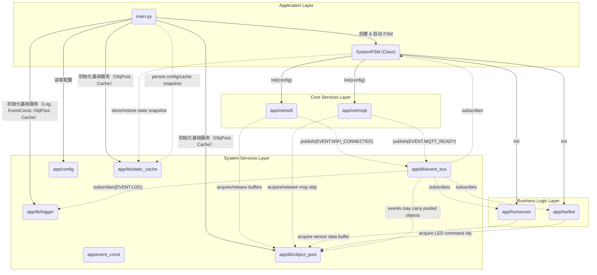

# ESP32-C3 IoT 设备架构文档 (重构版)

## 概述

本文档描述了 ESP32-C3 IoT 设备的软件架构，该架构已完成重构，采用事件驱动设计、模块化和依赖注入模式。重构后的架构显著提高了代码的可维护性、可测试性和可扩展性，特别适合资源受限的ESP32-C3环境。

## 设计原则

1. **模块化**：系统被分解为独立的模块，每个模块负责特定的功能。
2. **事件驱动**：模块之间通过事件总线进行通信，减少直接依赖。
3. **依赖注入**：通过 main.py 作为依赖注入容器，管理所有模块的创建和依赖关系。
4. **资源管理**：使用对象池和静态缓存来优化内存使用和性能。
5. **内存优化**：针对ESP32-C3的264KB内存限制进行专门优化。
6. **错误恢复**：多层次的错误处理和自动恢复机制。

## 系统架构

### 整体架构图



## 模块说明

### 应用层

#### main.py
- **职责**：依赖注入容器，负责创建和连接所有对象。
- **功能**：
  - 加载配置
  - 初始化核心服务
  - 创建模块控制器
  - 创建并启动状态机
  - 系统启动和错误处理

#### SystemFSM (app/fsm.py)
- **职责**：系统状态机，负责协调所有模块的初始化和运行。
- **状态**：
  - `BOOT`: 启动状态
  - `INIT`: 初始化状态
  - `NETWORKING`: 网络连接状态
  - `RUNNING`: 运行状态
  - `WARNING`: 警告状态
  - `ERROR`: 错误状态
  - `SAFE_MODE`: 安全模式
  - `RECOVERY`: 恢复状态
  - `SHUTDOWN`: 关机状态
- **功能**：
  - 管理系统状态转换
  - 处理系统事件
  - 执行重连策略
  - 将关键状态写入静态缓存
  - 错误恢复和自动重启
  - LED状态同步

### 系统服务层

#### app/event_const.py
- **职责**：定义统一的事件名称常量。
- **功能**：
  - 避免事件名称字符串散落在代码中
  - 提供事件名称的集中管理

#### app/lib/event_bus.py
- **职责**：事件总线，实现同步发布订阅模式。
- **接口**：
  - `subscribe(event_name, callback)`: 订阅事件
  - `publish(event_name, *args, **kwargs)`: 发布事件
  - `unsubscribe(event_name, callback)`: 取消订阅
- **功能**：
  - 提供模块间的松耦合通信
  - 支持事件参数传递
  - 错误隔离和恢复
  - 详细的日志记录

#### app/lib/logger.py
- **职责**：日志系统，订阅事件总线事件并处理日志输出。
- **接口**：
  - `setup(event_bus)`: 设置日志系统，订阅事件
- **功能**：
  - 订阅 `EVENT.LOG_*` 事件
  - 处理日志输出
  - 支持不同级别的日志

#### app/lib/object_pool.py
- **职责**：对象池管理器，实现多个命名对象池。
- **接口**：
  - `add_pool(name, object_factory, size)`: 添加对象池
  - `acquire(pool_name)`: 从指定池中获取对象
  - `release(obj)`: 将对象归还给池
  - `release_to_pool(pool_name, obj)`: 归还到指定池
- **功能**：
  - 管理多个对象池
  - 减少内存分配和释放操作
  - 自动对象归属跟踪
  - 智能内存分配

#### app/lib/static_cache.py
- **职责**：静态缓存系统，提供防抖写入和自动保存功能。
- **接口**：
  - `get(key, default=None)`: 获取值
  - `set(key, value)`: 设置值（防抖写入）
  - `load()`: 从闪存加载缓存
  - `save()`: 强制将缓存写入闪存
- **功能**：
  - 提供键值对缓存
  - 防抖写入机制
  - 自动保存到闪存

### 核心服务层

#### app/net/wifi.py
- **职责**：WiFi连接管理器。
- **接口**：
  - `__init__(self, event_bus, config)`: 初始化
  - `connect(self)`: 启动非阻塞连接
  - `disconnect(self)`: 断开连接
  - `loop(self)`: 循环处理
  - `start(self)`: 激活WLAN接口
- **功能**：
  - 管理WiFi连接状态
  - 多网络选择和RSSI排序
  - 发布WiFi相关事件
  - 非阻塞连接模式
  - 自动重连机制

#### app/net/mqtt.py
- **职责**：MQTT控制器。
- **接口**：
  - `__init__(self, event_bus, config)`: 初始化
  - `connect(self)`: 连接到MQTT代理
  - `disconnect(self)`: 断开连接
  - `publish(self, topic, msg, retain=False, qos=0)`: 发布消息
  - `subscribe(self, topic, qos=0)`: 订阅主题
  - `loop(self)`: 循环处理
- **功能**：
  - 管理MQTT连接状态
  - 处理消息收发
  - 发布MQTT相关事件
  - 指数退避重连策略
  - 心跳保持和超时检测

### 业务逻辑层

#### app/hw/sensor.py
- **职责**：传感器管理器。
- **接口**：
  - `__init__(self, event_bus, object_pool)`: 初始化
  - `update_all_sensors(self)`: 更新所有传感器
  - `add_sensor(self, sensor_id, read_func, interval, enabled)`: 添加传感器
  - `read_sensor(self, sensor_id)`: 读取传感器数据
- **功能**：
  - 管理多个传感器
  - 采集传感器数据
  - 通过事件总线发布数据
  - 支持内部和外部传感器
  - 使用对象池优化数据处理

#### app/hw/led.py
- **职责**：LED模式控制器。
- **接口**：
  - `__init__(self, led_pins)`: 初始化
  - `play(self, pattern_id)`: 播放LED模式
  - `cleanup(self)`: 清理资源
- **功能**：
  - 控制LED显示
  - 管理LED模式
  - 单例模式实现
  - 多种预设模式
  - 通过事件总线响应系统状态
  - 硬件定时器优化

## 初始化顺序

1. **boot.py**：平台相关启动，执行最小化硬件初始化
2. **main.py**：系统主入口，作为依赖注入容器
   - 加载配置
   - 初始化核心服务（EventBus, ObjectPool, StaticCache, Logger）
   - 初始化模块控制器（WiFi, MQTT, LED, Sensor）
   - 创建并启动状态机
3. **SystemFSM**：状态机负责按状态初始化其他模块
   - 初始化WiFi
   - 初始化MQTT
   - 初始化硬件模块
   - 进入运行状态

## 事件流程

### 系统启动流程
1. `main.py` 发布 `EVENT.SYSTEM_BOOT`
2. `SystemFSM` 接收事件，进入 `STATE_BOOT` 状态
3. `SystemFSM` 初始化WiFi，进入 `STATE_WIFI_CONNECTING` 状态
4. WiFi连接成功，发布 `EVENT.WIFI_CONNECTED`
5. `SystemFSM` 接收事件，初始化MQTT，进入 `STATE_MQTT_CONNECTING` 状态
6. MQTT连接成功，发布 `EVENT.MQTT_CONNECTED`
7. `SystemFSM` 接收事件，初始化硬件模块，进入 `STATE_RUNNING` 状态
8. `SystemFSM` 发布 `EVENT.SYSTEM_READY`

### 错误处理流程
1. 网络模块检测到错误，发布相应的错误事件
2. `SystemFSM` 接收错误事件，进入 `STATE_RECONNECTING` 状态
3. `SystemFSM` 执行重连策略
4. 重连成功或失败后，根据结果转换到相应状态

## 资源管理

### 对象池管理
- **mqtt_messages_pool**: MQTT消息对象池
- **sensor_data_pool**: 传感器数据对象池
- **log_messages_pool**: 日志消息对象池
- **system_events_pool**: 系统事件对象池

### 静态缓存管理
- **系统配置**: 存储系统配置信息
- **状态快照**: 存储系统状态信息
- **网络参数**: 存储网络连接参数

## 测试策略

### 单元测试
- **tests/test_object_pool.py**: 测试对象池功能
- **tests/test_event_bus.py**: 测试事件总线功能
- 其他模块的单元测试可以陆续添加

### 集成测试
- 测试模块间的交互
- 测试事件流的正确性
- 测试状态机的状态转换

### 系统测试
- 测试整个系统的启动流程
- 测试网络连接和重连机制
- 测试传感器数据采集和上报

## 部署和构建

### 构建流程
1. 使用 `build.py` 编译代码到 `dist/` 目录
2. 使用 `build.py --upload` 上传到设备的 `/app/` 目录

### 目录结构
```
IOT_ESP32C3/
├── app/                    # 设备运行代码（核心应用层）
│   ├── lib/               # 通用库和工具模块
│   │   ├── event_bus.py   # 事件总线
│   │   ├── object_pool.py # 对象池管理器
│   │   ├── static_cache.py # 静态缓存
│   │   ├── logger.py      # 日志系统
│   │   └── umqtt/         # MQTT客户端库
│   ├── hw/                # 硬件相关模块
│   │   ├── led.py         # LED控制器
│   │   └── sensor.py      # 传感器管理器
│   ├── net/               # 网络通信模块
│   │   ├── wifi.py        # WiFi管理器
│   │   └── mqtt.py        # MQTT控制器
│   ├── utils/             # 工具函数模块
│   │   ├── helpers.py     # 系统助手
│   │   └── timers.py      # 定时器工具
│   ├── boot.py           # 启动引导
│   ├── config.py         # 配置管理
│   ├── event_const.py    # 事件常量定义
│   ├── fsm.py            # 系统状态机
│   └── main.py           # 主程序入口
├── tests/                 # 单元测试
│   ├── test_event_bus.py
│   └── test_object_pool.py
├── docs/                  # 文档
│   └── architecture.md
├── build.py              # 构建脚本
└── requirements.txt      # Python依赖
```

## 总结

ESP32-C3 IoT 设备的软件架构已完成重构，采用事件驱动和模块化设计，通过依赖注入、对象池、事件总线等模式优化了资源管理和代码组织。这种架构显著提高了系统的可维护性、可测试性和可扩展性，特别适合资源受限的ESP32-C3嵌入式环境。

### 重构改进点

1. **事件驱动架构**：通过EventBus实现松耦合的模块间通信
2. **内存优化**：使用对象池和静态缓存减少GC压力
3. **错误恢复**：多层次的错误处理和自动恢复机制
4. **状态管理**：清晰的状态机系统管理设备生命周期
5. **模块化设计**：高度模块化的架构便于维护和扩展
6. **依赖注入**：通过main.py统一管理依赖关系

### 架构优势

- **高性能**：优化的内存管理和事件处理
- **高可靠**：健壮的错误处理和恢复机制
- **易维护**：清晰的模块划分和统一的接口
- **易扩展**：松耦合的设计便于添加新功能
- **资源友好**：针对ESP32-C3的264KB内存限制优化