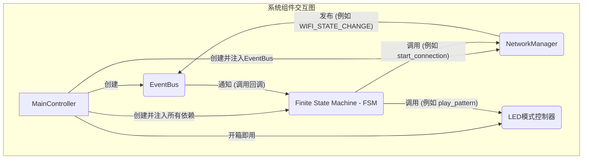

# 系统架构与流程图

## 系统组件交互图



## FSM与事件总线协作流程

```mermaid
graph TD
    direction LR
    
    subgraph 外部世界
        HW[硬件/网络模块 例如 NetworkManager]
    end

    subgraph 系统核心
        EB(EventBus)
        FSM_Core[FSM Core]
        SH[State Handlers]
    end

    HW -- "发布事件\n 例如 event_bus.publish" --> EB
    EB -- "定时器轮询\n 从队列取出事件" --> EB
    EB -- "调用已订阅的回调\n fsm._handle_event" --> FSM_Core
    FSM_Core -- "转换外部事件为内部事件\n 'wifi.state_change' -> 'wifi_connected'" --> FSM_Core
    FSM_Core -- "查找状态转换规则\n (NETWORKING, 'wifi_connected') -> RUNNING" --> FSM_Core
    FSM_Core -- "调用新旧状态的Handler\n exit_networking(), enter_running()" --> SH
    SH -- "执行具体操作\n 例如 network_manager.start_services()" --> HW
end
```

<style>
    .mermaid .actor {
        stroke: #cc0000;
        fill: #f8f8f8;
    }
    .mermaid .label {
        font-family: 'trebuchet ms', verdana, arial;
        color: #333;
    }
    .mermaid .node rect,
    .mermaid .node circle,
    .mermaid .node ellipse,
    .mermaid .node polygon,
    .mermaid .node path {
        fill: #f8f8f8;
        stroke: #333;
        stroke-width: 1px;
    }
    .mermaid .edgePath .path {
        stroke: #333;
        stroke-width: 1.5px;
    }
    .mermaid .edgeLabel {
        background-color: #e8e8e8;
    }
    .mermaid .cluster rect {
        fill: #ffffde;
        stroke: #aaaa33;
        stroke-width: 1px;
    }
    .mermaid .cluster text {
        fill: #333;
    }
</style>