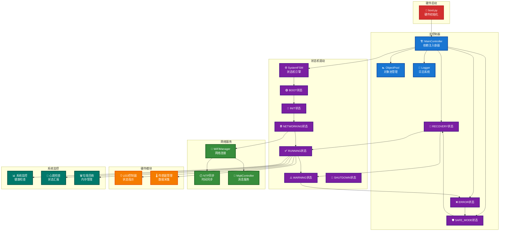
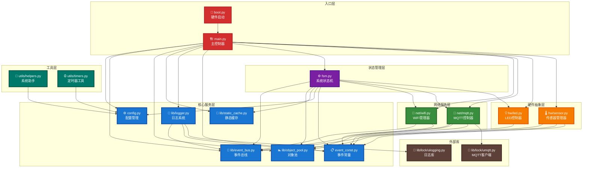
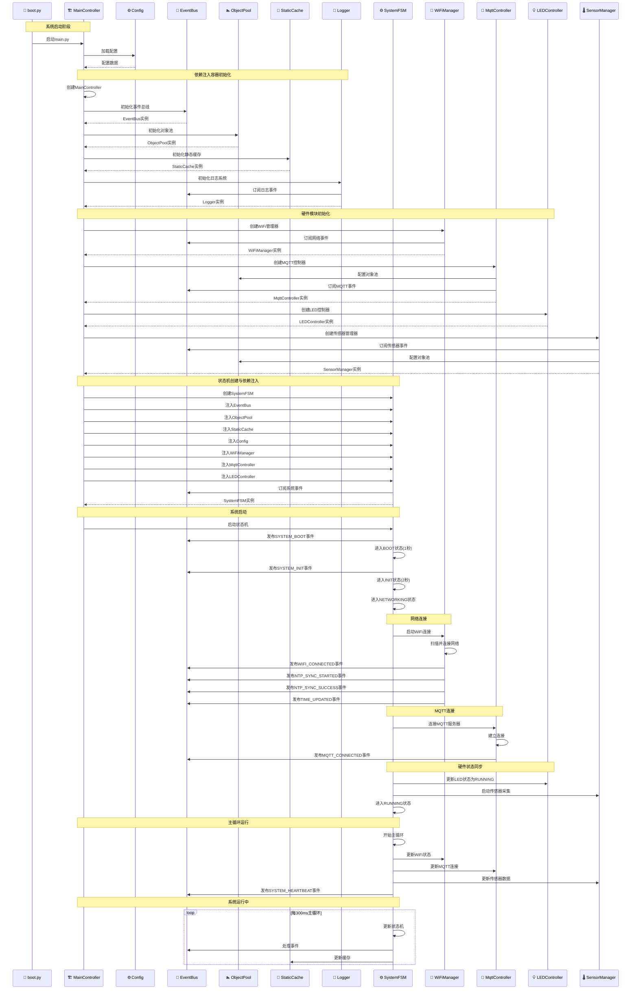

# ESP32-C3 系统启动流程图

## 1. 系统启动流程图

## 2. 事件类型分类图

```mermaid
graph TB
    subgraph "系统生命周期事件"
        BOOT[🟢 SYSTEM_BOOT<br/>系统启动]
        INIT[🔧 SYSTEM_INIT<br/>系统初始化]
        ERROR[❌ SYSTEM_ERROR<br/>系统错误]
        WARNING[⚠️ SYSTEM_WARNING<br/>系统警告]
        SHUTDOWN[🔴 SYSTEM_SHUTDOWN<br/>系统关机]
    end
    
    subgraph "网络通信事件"
        WIFI_C[📡 WIFI_CONNECTED<br/>WiFi已连接]
        WIFI_D[📵 WIFI_DISCONNECTED<br/>WiFi断开]
        WIFI_I[🔄 WIFI_CONNECTING<br/>WiFi连接中]
        MQTT_C[📡 MQTT_CONNECTED<br/>MQTT已连接]
        MQTT_D[📵 MQTT_DISCONNECTED<br/>MQTT断开]
        MQTT_M[📨 MQTT_MESSAGE<br/>MQTT消息]
    end
    
    subgraph "时间同步事件"
        NTP_S[🕐 NTP_SYNC_STARTED<br/>NTP同步开始]
        NTP_OK[✅ NTP_SYNC_SUCCESS<br/>NTP同步成功]
        NTP_FAIL[❌ NTP_SYNC_FAILED<br/>NTP同步失败]
        TIME_U[🕒 TIME_UPDATED<br/>时间更新]
    end
    
    subgraph "硬件事件"
        BTN[🔘 BUTTON_PRESSED<br/>按钮按下]
        SENSOR[🌡️ SENSOR_DATA<br/>传感器数据]
    end
    
    subgraph "系统管理事件"
        LOG_I[📝 LOG_INFO<br/>信息日志]
        LOG_W[⚠️ LOG_WARN<br/>警告日志]
        LOG_E[❌ LOG_ERROR<br/>错误日志]
        LOG_D[🐛 LOG_DEBUG<br/>调试日志]
        MEM_C[🚨 MEMORY_CRITICAL<br/>内存告急]
        HEART[💓 SYSTEM_HEARTBEAT<br/>系统心跳]
        REC_OK[✅ RECOVERY_SUCCESS<br/>恢复成功]
        REC_FAIL[❌ RECOVERY_FAILED<br/>恢复失败]
    end
    
    %% 事件总线中心
    subgraph "EventBus"
        EB[🔄 事件总线<br/>发布/订阅中心]
    end
    
    %% 事件流向
    BOOT --> EB
    INIT --> EB
    READY --> EB
    ERROR --> EB
    WARNING --> EB
    SHUTDOWN --> EB
    
    WIFI_C --> EB
    WIFI_D --> EB
    WIFI_I --> EB
    MQTT_C --> EB
    MQTT_D --> EB
    MQTT_M --> EB
    
    NTP_S --> EB
    NTP_OK --> EB
    NTP_FAIL --> EB
    TIME_U --> EB
    
    BTN --> EB
    SENSOR --> EB
    
    LOG_I --> EB
    LOG_W --> EB
    LOG_E --> EB
    LOG_D --> EB
    MEM_C --> EB
    HEART --> EB
    REC_OK --> EB
    REC_FAIL --> EB
    
    %% 样式
    classDef lifecycle fill:#1976d2,stroke:#0d47a1,stroke-width:3px,color:#ffffff
    classDef network fill:#388e3c,stroke:#1b5e20,stroke-width:3px,color:#ffffff
    classDef time fill:#7b1fa2,stroke:#4a148c,stroke-width:3px,color:#ffffff
    classDef hardware fill:#f57c00,stroke:#e65100,stroke-width:3px,color:#ffffff
    classDef management fill:#00796b,stroke:#004d40,stroke-width:3px,color:#ffffff
    classDef bus fill:#d32f2f,stroke:#b71c1c,stroke-width:3px,color:#ffffff
    
    class BOOT,INIT,READY,ERROR,WARNING,SHUTDOWN lifecycle
    class WIFI_C,WIFI_D,WIFI_I,MQTT_C,MQTT_D,MQTT_M network
    class NTP_S,NTP_OK,NTP_FAIL,TIME_U time
    class BTN,SENSOR hardware
    class LOG_I,LOG_W,LOG_E,LOG_D,MEM_C,HEART,REC_OK,REC_FAIL management
    class EB bus
```

## 3. 详细事件类型表

| 事件类别 | 事件名称 | 说明 |
|---------|---------|------|
| **系统事件** | SYSTEM_BOOT | 系统启动 |
|  | SYSTEM_INIT | 系统初始化 |
|  | SYSTEM_ERROR | 系统错误 |
|  | SYSTEM_WARNING | 系统警告 |
|  | SYSTEM_SHUTDOWN | 系统关机 |
| **网络事件** | WIFI_CONNECTED | WiFi已连接 |
|  | WIFI_DISCONNECTED | WiFi断开 |
|  | WIFI_CONNECTING | WiFi连接中 |
|  | MQTT_CONNECTED | MQTT已连接 |
|  | MQTT_DISCONNECTED | MQTT断开 |
|  | MQTT_MESSAGE | MQTT消息 |
| **时间事件** | NTP_SYNC_STARTED | NTP同步开始 |
|  | NTP_SYNC_SUCCESS | NTP同步成功 |
|  | NTP_SYNC_FAILED | NTP同步失败 |
|  | TIME_UPDATED | 时间更新 |
| **硬件事件** | BUTTON_PRESSED | 按钮按下 |
|  | SENSOR_DATA | 传感器数据 |
| **日志事件** | LOG_INFO | 信息日志 |
|  | LOG_WARN | 警告日志 |
|  | LOG_ERROR | 错误日志 |
|  | LOG_DEBUG | 调试日志 |
| **管理事件** | MEMORY_CRITICAL | 内存告急 |
|  | SYSTEM_HEARTBEAT | 系统心跳 |
| **恢复事件** | RECOVERY_SUCCESS | 恢复成功 |
|  | RECOVERY_FAILED | 恢复失败 |

## 4. 模块依赖关系图

## 5. 启动时序图

## 设计特点

### 🔄 完全重构的事件驱动架构
- **真实反映系统启动过程**: 基于main.py和fsm.py的实际代码结构
- **依赖注入容器**: MainController作为核心容器，统一管理所有依赖
- **状态机驱动**: SystemFSM控制整个启动流程和状态转换
- **事件总线中心**: EventBus作为模块间通信的核心枢纽

### 📊 详细的模块依赖关系
- **清晰的分层架构**: 入口层 → 核心服务层 → 状态管理层 → 网络服务层 → 硬件抽象层 → 工具层
- **明确的依赖注入**: 每个模块的依赖关系都清晰标注
- **松耦合设计**: 通过事件总线实现模块间的松耦合通信

### ⚡ 精确的启动时序
- **分阶段启动**: 系统启动 → 依赖注入 → 硬件初始化 → 状态机启动 → 网络连接 → 运行状态
- **事件驱动流程**: 每个阶段都通过事件进行状态转换和模块协调
- **完整的生命周期**: 从BOOT到RUNNING的完整状态转换过程

### 🎨 现代化的视觉设计
- **高对比度配色**: 使用Material Design色彩体系，确保在各种背景下清晰可读
- **丰富的图标**: 使用emoji图标增强视觉识别度
- **清晰的分组**: 通过subgraph实现逻辑分组，便于理解系统结构
- **统一的设计语言**: 所有图表保持一致的设计风格

## 配色方案

### 🎨 系统启动流程图
- **硬件启动**: 红色 (#d32f2f) - 代表底层硬件
- **主控制器**: 深蓝色 (#1976d2) - 代表系统核心
- **状态机驱动**: 紫色 (#7b1fa2) - 代表状态管理
- **网络服务**: 绿色 (#388e3c) - 代表网络连接
- **硬件模块**: 橙色 (#f57c00) - 代表外设
- **系统监控**: 青绿色 (#00796b) - 代表监控管理

### 🎨 事件类型分类图
- **系统生命周期事件**: 深蓝色 (#1976d2) - 代表系统核心事件
- **网络通信事件**: 绿色 (#388e3c) - 代表网络相关事件
- **时间同步事件**: 紫色 (#7b1fa2) - 代表时间相关事件
- **硬件事件**: 橙色 (#f57c00) - 代表硬件相关事件
- **系统管理事件**: 青绿色 (#00796b) - 代表管理相关事件
- **事件总线**: 红色 (#d32f2f) - 代表消息中心

### 🎨 模块依赖关系图
- **入口层**: 红色 (#d32f2f) - 代表系统入口
- **核心服务层**: 深蓝色 (#1976d2) - 代表核心组件
- **状态管理层**: 紫色 (#7b1fa2) - 代表状态管理
- **网络服务层**: 绿色 (#388e3c) - 代表网络服务
- **硬件抽象层**: 橙色 (#f57c00) - 代表硬件抽象
- **工具层**: 青绿色 (#00796b) - 代表辅助工具
- **外部库**: 棕色 (#5d4037) - 代表第三方库

## 🚀 核心改进

### 1. **事件驱动架构**
- 完全基于事件总线的松耦合设计
- 状态机通过事件驱动状态转换
- 模块间通过事件进行通信

### 2. **依赖注入模式**
- MainController作为依赖注入容器
- 所有依赖在启动时统一注入
- 模块间的依赖关系清晰明确

### 3. **状态机管理**
- SystemFSM控制整个系统生命周期
- 支持错误恢复和状态回滚
- LED状态与系统状态同步

### 4. **内存优化**
- 对象池管理减少GC压力
- 静态缓存避免频繁Flash写入
- 智能垃圾回收机制

### 5. **错误处理机制**
- 分级错误处理和自动恢复
- 看门狗保护防止系统死锁
- 完整的日志记录和监控

## 💡 使用说明

这些流程图展示了ESP32-C3物联网设备的完整启动过程和系统架构：

1. **启动流程图**: 展示从硬件启动到系统运行的完整流程
2. **事件分类图**: 展示系统中的所有事件类型和事件流向
3. **模块依赖图**: 展示各模块间的依赖关系和分层架构
4. **启动时序图**: 详细展示启动过程中的时序和事件流

所有图表都经过优化，确保在一页内完整显示，并提供清晰的视觉层次结构。